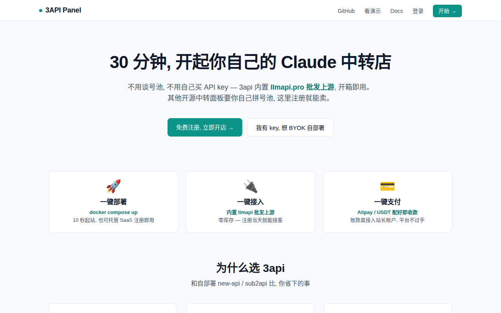
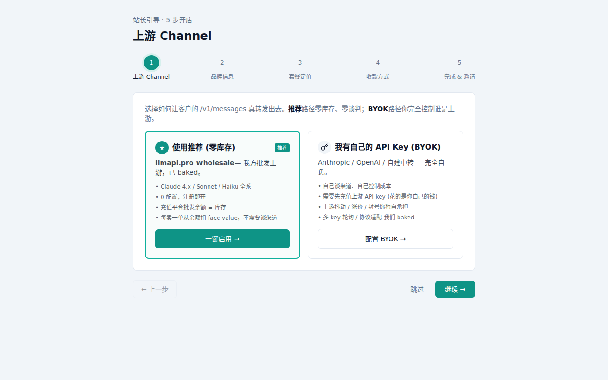
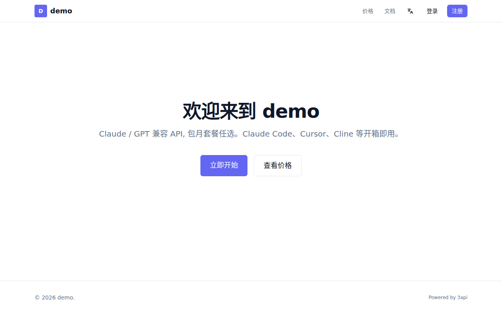
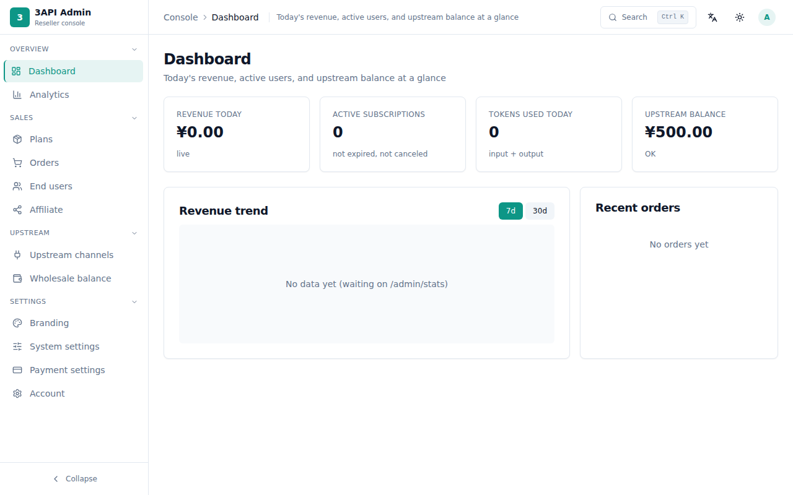
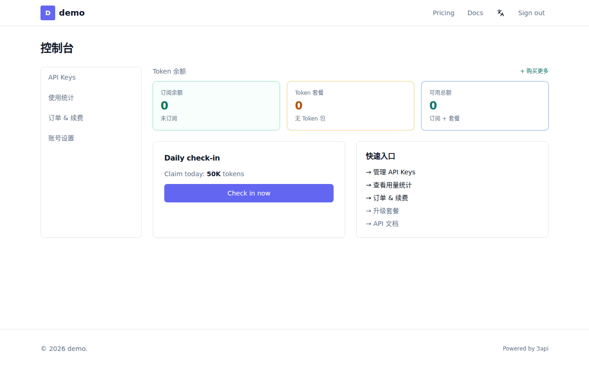

<div align="center">
  
  <h1>3api / relay-panel</h1>
  <p><strong>Multi-tenant Claude/OpenAI relay panel &mdash; zero inventory, one-click upstream, 30-minute store launch.</strong></p>
  <p>
    <a href="https://github.com/3api-pro/relay-panel/blob/main/LICENSE"></a>
    <a href="https://github.com/3api-pro/relay-panel/releases"></a>
    <a href="https://github.com/3api-pro/relay-panel/actions/workflows/ci.yml"></a>
    <a href="https://github.com/3api-pro/relay-panel/stargazers"></a>
  </p>
  <p>
    <a href="https://3api.pro">Website</a> &middot;
    <a href="https://demo.3api.pro">Live Demo</a> &middot;
    <a href="docs/QUICKSTART.md">Quick Start</a> &middot;
    <a href="docs/ARCHITECTURE.md">Architecture</a> &middot;
    <a href="https://github.com/3api-pro/relay-panel/discussions">Discussions</a>
  </p>
  <p><em>English &middot; <a href="docs/README.zh-CN.md">简体中文</a></em></p>
</div>

---

## What is this?

**3api/relay-panel** is the missing self-hostable control panel for anyone who wants
to resell access to Claude / OpenAI compatible LLM APIs. Spin up a branded
`<your-slug>.3api.pro` (or your own custom domain), let customers self-signup,
sell them subscriptions or token packs, and route their traffic to
**any** compatible upstream &mdash; your own keys, our wholesale pool,
or both with failover. The relay forwards three protocols transparently:

- `POST /v1/messages` &mdash; Anthropic Messages API (Claude Code, Hermes, IDE plugins)
- `POST /v1/chat/completions` &mdash; OpenAI Chat Completions (OpenAI SDK, LiteLLM)
- `POST /v1/responses` &mdash; OpenAI Responses API (Codex CLI `0.130+`)

All three share one storefront, one customer login, one billing pipeline.

Unlike Go-based `one-api` / `new-api`, this is a modern **TypeScript + Postgres +
Next.js** stack with first-class multi-tenancy, an onboarding wizard, a real
storefront UI, and native subscription billing &mdash; not just token quota.

> **Why 3api?** Other open-source relay panels (`new-api`, `sub2api`) ship empty
> &mdash; you bring your own Anthropic / OpenAI keys, negotiate quota, rotate
> banned keys, eat the upstream outages. **3api comes pre-wired to
> `llmapi.pro` wholesale upstream**: register and you're selling on day one.
> BYOK is still supported &mdash; mix freely. Full positioning piece:
> [docs/WHY-3API.md](docs/WHY-3API.md).

## Quick Start &mdash; Pick One

### Option A: Hosted SaaS (5 seconds)

Visit <https://3api.pro/create> &rarr; register email + password &rarr;
auto-assigned subdomain like `swift-fox-7k9m.3api.pro` &rarr; you land on
`/admin` with wholesale upstream, 4 plans and 2 token packs pre-seeded.
Configure Alipay merchant ID + USDT addresses and share the subdomain link.

### Option B: Self-host with one command (30 seconds)

```bash
git clone https://github.com/3api-pro/relay-panel
cd relay-panel
cp .env.example .env       # edit POSTGRES_PASSWORD, JWT_SECRET
docker compose up -d
# → open http://localhost:8080 → signup → onboarding wizard → done
```

> Works on any host with Docker &mdash; Linux, macOS, or Windows
> (via Docker Desktop / WSL2). For production, put it behind your own
> reverse proxy or use the bundled Caddyfile.

Full walkthrough (including the hosted path) in
[docs/QUICKSTART.md](docs/QUICKSTART.md).

## Screenshots

> Captured from a live `demo` tenant on v0.4 (see [docs/SCREENSHOTS.md](docs/SCREENSHOTS.md) to regenerate).

| Marketing landing | Admin onboarding | Storefront |
|---|---|---|
|  |  |  |

| Admin dashboard | End-user dashboard |
|---|---|
|  |  |

## Why 3api vs one-api / new-api / sub2api

|                                                  | **3api** | one-api | new-api | sub2api |
|--------------------------------------------------|:--------:|:-------:|:-------:|:-------:|
| Multi-tenant (subdomain per reseller)            | ✅       | ❌      | ❌      | ❌      |
| Bundled wholesale upstream (no key sourcing)     | ✅       | ❌      | ❌      | ⚠️      |
| Custom domain w/ auto-TLS (Caddy on-demand)      | ✅       | ❌      | ❌      | ❌      |
| Modern Next.js + Tailwind UI                     | ✅       | ❌      | ⚠️      | ✅      |
| Native subscription billing (not just token)     | ✅       | ❌      | ⚠️      | ✅      |
| Alipay + USDT checkout                           | ✅       | ⚠️      | ✅      | ✅      |
| TypeScript + Postgres (modern stack)             | ✅       | ❌ Go   | ❌ Go   | ❌ Go   |
| MIT licensed                                     | ✅       | ✅      | ✅      | ❓      |

> ⚠️ = partial / community plugin only. See
> [docs/COMPARISON.md](docs/COMPARISON.md) for the full matrix and the
> rationale behind each ✅.

## Architecture

```
Customer ──▶ <slug>.3api.pro ──▶ Tenant Middleware ──▶ Multi-protocol Relay ──▶ Upstream (BYOK or wholesale)
                                                       ├─ /v1/messages          (Anthropic)
                                                       ├─ /v1/chat/completions  (OpenAI)
                                                       └─ /v1/responses         (OpenAI/Codex)
                  │                       │
                  ▼                       ▼
              Admin UI                Postgres (tenants/plans/subs/usage)
```

Full diagram, multi-tenant strategy, money flow and security boundaries:
[docs/ARCHITECTURE.md](docs/ARCHITECTURE.md).

## What's Inside

- **Multi-tenant routing** &mdash; tenant resolved from subdomain or custom domain
- **Admin onboarding wizard** &mdash; upstream config, branding, first plan, first customer
- **Plans / orders / subscriptions / API tokens** &mdash; full CRUD on both sides
- **Multi-protocol relay** &mdash; `/v1/messages` (Anthropic) + `/v1/chat/completions` + `/v1/responses` (OpenAI) with streaming, billing, usage logging on all three
- **BYOK + wholesale** &mdash; mix your own keys with our pool, priority + failover
- **Storefront** &mdash; brand-customizable (logo, color, announcement, hero copy)
- **Checkout** &mdash; Alipay + USDT (Paddle / Stripe on roadmap)
- **Analytics dashboard** &mdash; per-tenant revenue, usage, top customers
- **Resend mailer** &mdash; transactional emails out of the box

## Roadmap

See [docs/ROADMAP.md](docs/ROADMAP.md) for the live execution plan. Highlights:

- [x] **v0.1.0** &mdash; MVP storefront, BYOK relay, multi-tenant routing (current)
- [ ] **v0.2.0** &mdash; Custom-domain auto-TLS, referral program, public OpenAPI spec
- [ ] **v0.3.0** &mdash; Telegram bot, Discord webhook notifications, audit log export
- [ ] **v0.4.0** &mdash; Mobile-optimized storefront, PWA, white-label mobile app

## Contributing

Bug reports → [issues](https://github.com/3api-pro/relay-panel/issues).
Feature ideas → [discussions](https://github.com/3api-pro/relay-panel/discussions).
PRs welcome &mdash; please read [CONTRIBUTING.md](CONTRIBUTING.md) first
(`npm test` PASS, conventional commits, no `src/` churn without an issue).

Security disclosures → see [SECURITY.md](SECURITY.md).

By participating you agree to the [Code of Conduct](CODE_OF_CONDUCT.md).

## License

[MIT](LICENSE) &copy; 2026 3api-pro contributors. Built upon ideas from
`one-api` (Apache-2.0) and `new-api`.

## Disclaimer

Independent open-source project. **Not affiliated** with Anthropic, OpenAI,
or any LLM vendor. The default upstream `api.llmapi.pro` is operated by an
independent provider; you can swap it for any Anthropic-compatible endpoint
in the admin panel. You are responsible for complying with your upstream's
terms of service and your local laws when reselling.