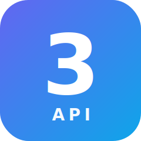

<div align="center">
  
  <h1>3api / relay-panel</h1>
  <p><strong>开源多租户 Claude 兼容 API 中转面板 &mdash; 30 分钟把自己变成 AI API 二级代理。</strong></p>
  <p><em><a href="../README.md">English</a> &middot; 简体中文</em></p>
</div>

---

## 这是什么？

**3api/relay-panel** 是一个面向"想做 AI API 二级代理"群体的、可自部署的开源控制面板。

跑起来之后你能：

- 在 `<你的 slug>.3api.pro`（或自己的域名）上挂自己的店面
- 让终端用户自助注册、自助下单
- 卖订阅 / 卖 token 包 / 卖兑换码，任你选
- 把 `/v1/messages` 流量转发到**任何 Anthropic 兼容上游** —— 你自己的 key、我们的批发号池，或两者混用 + failover

跟 Go 系的 `one-api` / `new-api` 比，这是个现代化的 **TypeScript + Postgres + Next.js** 栈，原生多租户、有引导向导、有真正像样的店面 UI、原生支持订阅计费（不只是 token 扣额）。

## 30 秒上手

```bash
git clone https://github.com/3api-pro/relay-panel
cd relay-panel
cp .env.example .env       # 改 POSTGRES_PASSWORD、JWT_SECRET
docker compose up -d
# → 打开 http://localhost:8080 → 注册 → 引导向导 → 完成
```

完整 5 分钟教程见 [QUICKSTART.md](QUICKSTART.md)。

## 和 one-api / new-api / sub2api 的差别

|                                          | **3api** | one-api | new-api | sub2api |
|------------------------------------------|:--------:|:-------:|:-------:|:-------:|
| 多租户（一店一子域）                     | ✅       | ❌      | ❌      | ❌      |
| 内置上游（不用自己谈 key）               | ✅       | ❌      | ❌      | ⚠️      |
| 自定义域名 + 自动 TLS                    | ✅       | ❌      | ❌      | ❌      |
| 现代 Next.js + Tailwind UI               | ✅       | ❌      | ⚠️      | ✅      |
| 原生订阅计费（不只是 token）             | ✅       | ❌      | ⚠️      | ✅      |
| 支付宝 + USDT                            | ✅       | ⚠️      | ✅      | ✅      |
| TypeScript + Postgres 栈                 | ✅       | ❌ Go   | ❌ Go   | ❌ Go   |
| MIT 许可                                 | ✅       | ✅      | ✅      | ❓      |

## 架构

```
终端用户 ──▶ <slug>.3api.pro ──▶ 租户中间件 ──▶ /v1/messages 中转 ──▶ 上游 (自带 key 或 我们的批发号池)
                  │                     │
                  ▼                     ▼
              管理后台              Postgres (tenants / plans / subs / usage)
```

详见 [ARCHITECTURE.md](ARCHITECTURE.md)。

## 路线图

见 [ROADMAP.md](ROADMAP.md)。

## License

[MIT](../LICENSE) &copy; 2026 3api-pro 贡献者。借鉴自 `one-api` (Apache-2.0) 和 `new-api`。

## 免责

独立开源项目。**与 Anthropic、OpenAI 或任何上游 LLM 厂商无任何隶属关系。**
默认上游 `api.llmapi.pro` 由独立第三方运营，你也可以在管理后台换成任何 Anthropic 兼容端点。
转售时请遵守你所选上游的服务条款及当地法律法规。